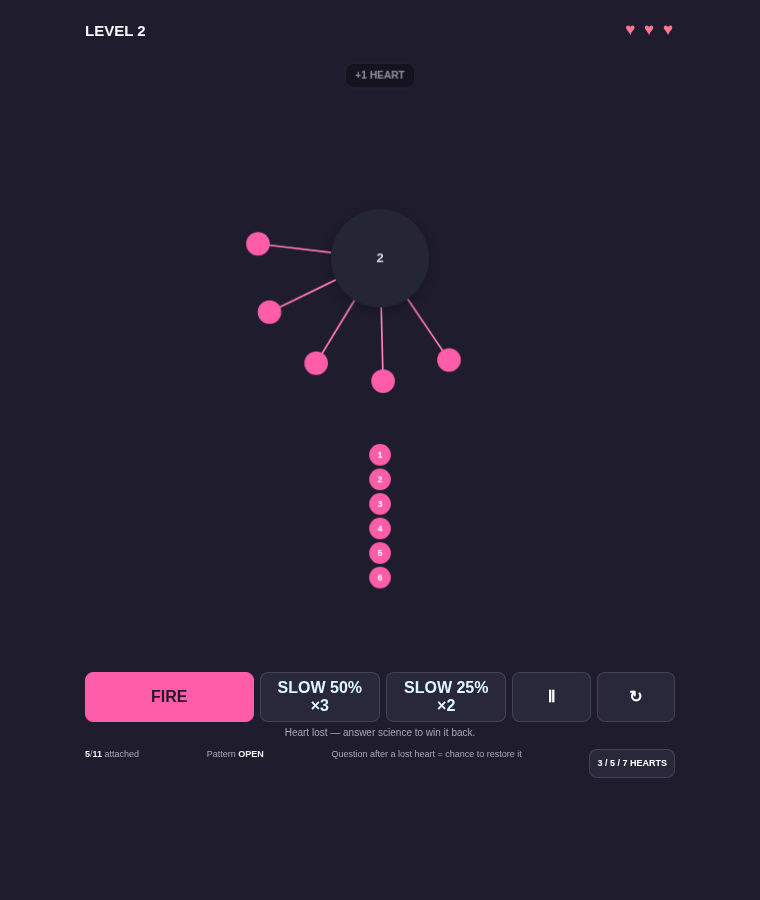
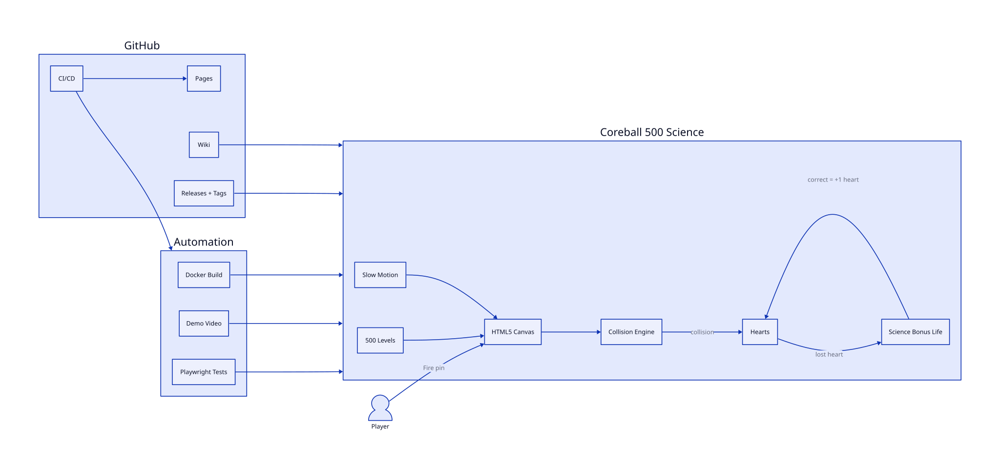

# Coreball 500 Science

[](https://github.com/iamrichmack111/coreball-500-science/actions/workflows/ci.yml)
[](https://github.com/iamrichmack111/coreball-500-science/actions/workflows/pages.yml)
[](https://github.com/iamrichmack111/coreball-500-science/actions/workflows/docker.yml)
[](media/coreball-demo.mp4)
[](https://github.com/iamrichmack111/coreball-500-science/releases)

A Core Ball-style browser game with **500 deterministic levels**, rotating-pin collision gameplay, selectable hearts, slow-motion power-ups, and science questions that can restore a lost life.

## Demo

[▶ Watch the committed MP4 demo](media/coreball-demo.mp4)



## Features

- 500 challenge levels
- Pre-attached rotating pins
- Continuous collision detection
- 3 / 5 / 7 heart modes
- Science bonus-life questions after collisions
- 50% and 25% slow-motion modes
- Playwright smoke tests and screenshots
- Playwright demo-video recording
- GitHub Actions CI/CD
- GitHub Pages deployment
- Docker + Nginx runtime
- D2 architecture source and rendered SVG
- GitHub Wiki
- Tagged GitHub releases

## Architecture



D2 source: [`docs/architecture.d2`](docs/architecture.d2)

## Run locally

```bash
chmod +x start.sh
./start.sh
```

## Docker

```bash
docker compose up --build
```

Open `http://127.0.0.1:8088`.

## Tests

```bash
npm install
npx playwright install chromium
npm test
```

## One-command GitHub setup

```bash
./SETUP_GITHUB.sh
```

The setup script targets `iamrichmack111/coreball-500-science` by default, publishes the Wiki, ensures Pages is enabled, downloads the generated Playwright MP4 into the repository, pushes the final commit, and creates `v1.0.0`.
